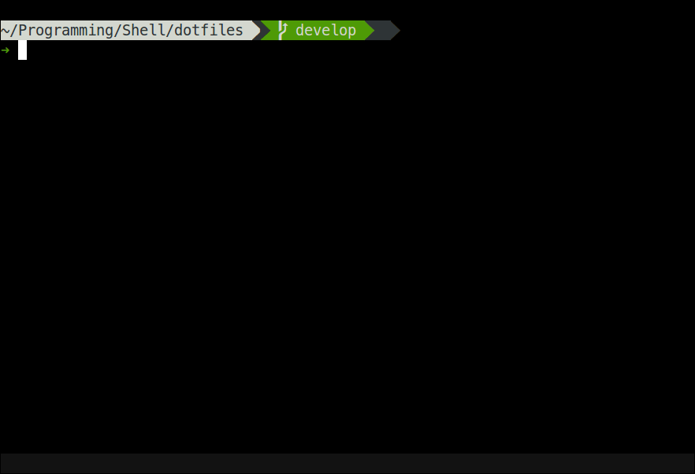

Window to GIF
=============

This script allows you to make a gif easily from a window.



Installation
------------

This requires byzanz. You can install this on a recent version of ubuntu with the following:

```bash
sudo apt-get install byzanz
```

If you have [antigen](https://github.com/zsh-users/antigen) then just run the following:

```bash
antigen-bundle matthewfranglen/window-to-gif
```

Otherwise just clone this repo and add the `window-to-gif` command to the $PATH.

Usage
-----

When you call the script you must:

1. Click on a window
2. Get ready (10 second timer)
3. Do your thing for 10 seconds
4. Open the generated `out.gif` file

Options
-------

    -d=DURATION --duration=DURATION
        Duration of recording in seconds

    -f=FILE --file=FILE
        File path for generated gif
